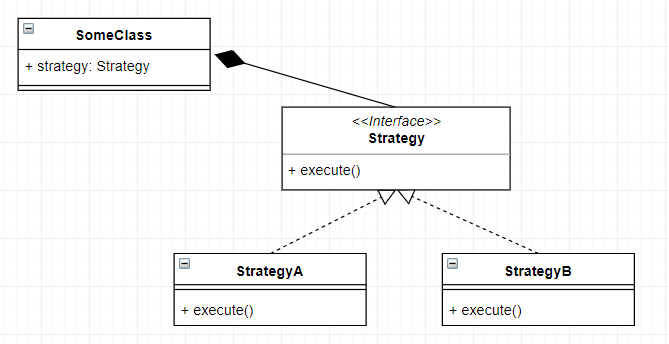

# Strategy pattern

Strategy is a behavioral design pattern that lets you define a family of algorithms, put each of them into a separate class, and make their objects interchangeable. More composition, less heritance.

In Java, it's often used to change class behavior without needing to extend and override their methods.

